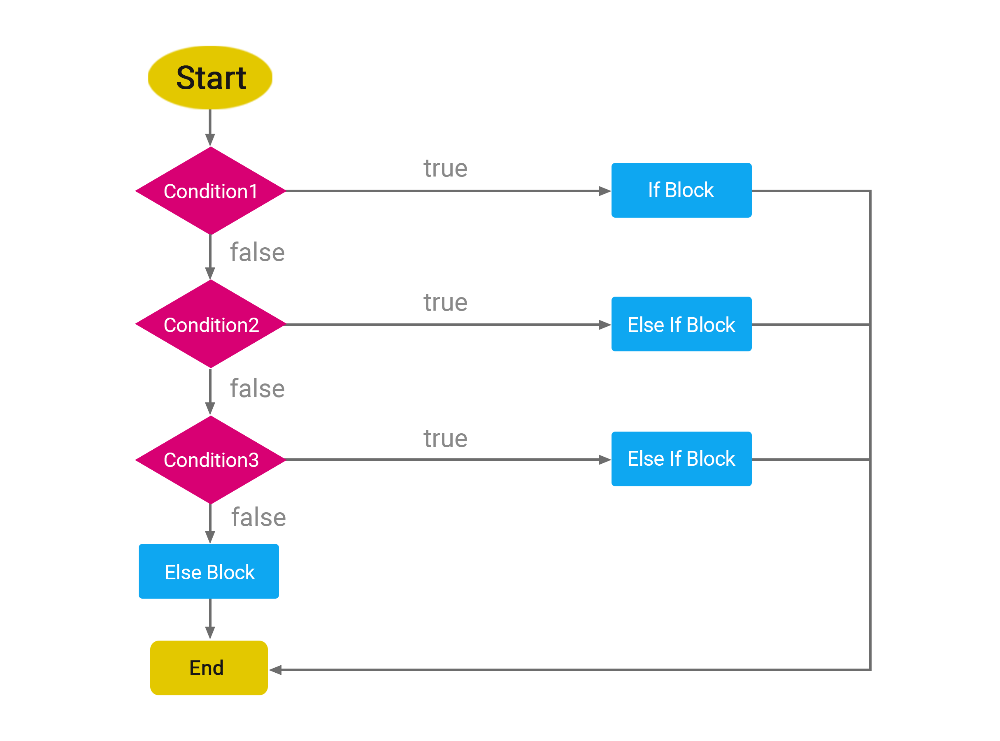

# Câu lệnh điều kiện

Mục lục

* [Toán tử so sánh](cau-lenh-dieu-kien.md#toan-tu-so-sanh)
  * [So sánh bằng và không bằng (Không nghiêm ngặt)](cau-lenh-dieu-kien.md#so-sanh-bang-va-khong-bang-khong-nghiem-ngat)
  * [So sánh bằng và không bằng (Nghiêm ngặt)](cau-lenh-dieu-kien.md#so-sanh-bang-va-khong-bang-nghiem-ngat)
  * [So sánh lớn hơn và nhỏ hơn](cau-lenh-dieu-kien.md#so-sanh-lon-hon-va-nho-hon)
  * [Lớn hơn hoặc bằng và nhỏ hơn hoặc bằng](cau-lenh-dieu-kien.md#lon-hon-hoac-bang-va-nho-hon-hoac-bang)
* [If-else](cau-lenh-dieu-kien.md#if-else)
  * [if](cau-lenh-dieu-kien.md#if)
  * [else](cau-lenh-dieu-kien.md#else)
  * [else if](cau-lenh-dieu-kien.md#else-if)
  * [If-else flowchart](cau-lenh-dieu-kien.md#if-else-flowchart)
  * [Inline if-else](cau-lenh-dieu-kien.md#inline-if-else)
  * [Toán tử 3 ngôi (Ternary operator)](cau-lenh-dieu-kien.md#toan-tu-3-ngoi-ternary-operator)
* [Switch case](cau-lenh-dieu-kien.md#switch-case)
  * [Switch case cơ bản](cau-lenh-dieu-kien.md#switch-case-co-ban)
  * [Fallthrough](cau-lenh-dieu-kien.md#fallthrough)
  * [Switch case trong hàm](cau-lenh-dieu-kien.md#switch-case-trong-ham)
* [Lưu ý khi sử dụng](cau-lenh-dieu-kien.md#luu-y-khi-su-dung)
  * [Toán tử so sánh](cau-lenh-dieu-kien.md#toan-tu-so-sanh-1)
  * [Câu lệnh if-else](cau-lenh-dieu-kien.md#cau-lenh-if-else)
  * [Toán tử 3 ngôi](cau-lenh-dieu-kien.md#cau-lenh-if-else)
  * [Câu lệnh switch case](cau-lenh-dieu-kien.md#cau-lenh-switch-case)
* [Lỗi thường gặp](cau-lenh-dieu-kien.md#loi-thuong-gap)
  * [Nhầm lẫn giữa = và ==/===](cau-lenh-dieu-kien.md#nham-lan-giua-va)
  * [Quên break trong switch](cau-lenh-dieu-kien.md#quen-break-trong-switch)
  * [Sử dụng if-else không hiệu quả](cau-lenh-dieu-kien.md#su-dung-if-else-khong-hieu-qua)
  * [Sử dụng toán tử so sánh không phù hợp](cau-lenh-dieu-kien.md#su-dung-toan-tu-so-sanh-khong-phu-hop)

### Toán tử so sánh

Toán tử so sánh trong JavaScript được sử dụng để so sánh hai giá trị, thường trong các lệnh điều kiện.

#### So sánh bằng và không bằng (Không nghiêm ngặt)

* **==**: So sánh hai giá trị xem có bằng nhau về giá trị, không so sánh kiểu dữ liệu.
* **!=**: So sánh hai giá trị xem có khác nhau về giá trị, không so sánh kiểu dữ liệu.

Ví dụ:

```js
/**
 * So sánh hai giá trị xem có bằng nhau không (==).
 */
5 == 5; // true
5 == "5"; // true
"Hello" == "Hello"; // true

3 == 4; // false
"Hi" == "Hello"; // false
"hello" == "Hello"; // false

/**
 * So sánh hai giá trị xem có khác nhau không (!=)
 */
3 != 3; // false
3 != "3"; // false
"Hello" != "Hello"; // false

3 != 5; // true
"Hello" != "Hi"; // true
```

Với toán tử so sánh “không nghiêm ngặt”, hai toán hạng sẽ được chuyển đổi về cùng một kiểu dữ liệu rồi thực hiện so sánh.

#### So sánh bằng và không bằng (Nghiêm ngặt)

* **===**: So sánh hai giá trị xem có bằng nhau về giá trị và kiểu dữ liệu.
* **!==**: So sánh hai giá trị xem có khác nhau về giá trị và kiểu dữ liệu.

Ví dụ:

```js
/**
 * So sánh hai giá trị xem có bằng nhau không (===).
 */
5 === 5; // true
5 === "5"; // false

/**
 * So sánh hai giá trị xem có khác nhau không (!==)
 */
3 !== 3; // false
3 !== "3"; // true
```

Với toán tử so sánh “nghiêm ngặt”, các toán hạng sẽ không bị chuyển đổi kiểu dữ liệu.

**Nên sử dụng so sánh “không nghiêm ngặt” hay “nghiêm ngặt”?**

Để tránh các lỗi logic về kiểu dữ liệu bạn chỉ nên sử dụng toán tử “nghiêm ngặt” (`===`).

#### So sánh lớn hơn và nhỏ hơn

* **>**: So sánh lớn hơn.
* **<**: So sánh nhỏ hơn.

Ví dụ:

```js
5 > 3; // true
5 < 3; // false
2 < 2; // false
2 > 2; // false
```

#### Lớn hơn hoặc bằng và nhỏ hơn hoặc bằng

* **>=**: So sánh lớn hơn hoặc bằng.
* **<=**: So sánh nhỏ hơn hoặc bằng.

Ví dụ:

```js
2 >= 2; // true
2 <= 2; // true

2 <= 3; // true
3 >= 2; // true

3 >= 4; // false
5 <= 2; // false
```

***

### If-else

Lệnh điều kiện trong JavaScript cho phép thực hiện các quyết định dựa trên các điều kiện nhất định.

#### if

* Cú pháp cơ bản: `if (điều kiện) { // Khối lệnh }`
* Nếu điều kiện là `true`, khối lệnh bên trong được thực thi.

Ví dụ:

```js
let temperature = 40;

if (temperature > 30) {
    console.log("It's a hot day.");
}
```

#### else

* Thêm vào sau một câu lệnh if.
* Thực thi khối lệnh nếu điều kiện trong if không đúng.
* Cú pháp: `if (điều kiện) { // Khối lệnh 1 } else { // Khối lệnh 2 }`

Ví dụ:

```js
let temperature = 20;

if (temperature > 30) {
    console.log("It's a hot day.");
} else {
    console.log("It's not a hot day.");
}
```

#### else if

* Cho phép thêm nhiều điều kiện kiểm tra.
* Cú pháp: `if (điều kiện1) { // Khối lệnh 1 } else if (điều kiện2) { // Khối lệnh 2 } ... else { // Khối lệnh cuối }`

Ví dụ:

```js
let temperature = 18;

if (temperature > 30) {
    console.log("It's a hot day.");
} else if (temperature > 20) {
    console.log("It's a nice day.");
} else {
    console.log("It's a cold day.");
}
```

#### If-else flowchart

“If-else flowchart” là một biểu đồ dùng để mô tả luồng điều khiển trong các thuật toán hoặc chương trình máy tính, dựa trên cấu trúc lựa chọn “if-else” (nếu - nếu không). Đây là cách để biểu diễn logic của một chương trình khi phải đưa ra quyết định dựa trên một hoặc nhiều điều kiện.

<figure><figcaption><p><em>“If-else flowchart” giúp dễ dàng nhận biết và theo dõi luồng xử lý trong if-else.</em></p></figcaption></figure>

#### Inline if-else

Inline if-else cách viết rút gọn của cấu trúc `if-else` mà không cần sử dụng dấu `{}` được áp dụng khi mỗi nhánh của `if` hoặc `else` chỉ chứa một dòng lệnh.

Cú pháp:

```js
if (điều kiện) lệnh_1;
else lệnh_2;
```

Ví dụ:

```js
let isRainy = true;

if (isRainy) console.log("Hãy mang theo ô");
else console.log("Không cần mang theo ô");
```

#### Toán tử 3 ngôi (Ternary operator)

* Một dạng rút gọn của lệnh `if-else`.
* Cú pháp: `điều kiện ? biểu_thức_nếu_true : biểu_thức_nếu_false`

Ví dụ:

```js
let temperature = 32;
let result = temperature > 30 ? "It's a hot day." : "It's not a hot day.";

console.log(result); // It's a hot day.
```

***

### Switch case

#### Switch case cơ bản

Cấu trúc `switch case` trong JavaScript là một cách để thực hiện các hành động khác nhau dựa trên giá trị của một biến hoặc biểu thức. Nó là một lựa chọn thay thế cho việc sử dụng nhiều câu lệnh `if-else` liên tiếp và thường được sử dụng khi bạn cần so sánh cùng một biến với nhiều giá trị khác nhau.

Cú pháp:

```js
switch (biến) {
  case giá_trị_1:
    // Khối lệnh
    break;
  case giá_trị_2:
    // Khối lệnh
    break;
  ...
  default:
    // Khối lệnh mặc định
}
```

Ví dụ:

```js
let day = 1;

switch (day) {
    case 1:
        console.log("Monday");
        break;
    case 2:
        console.log("Tuesday");
        break;
    default:
        console.log("Unknown Day");
}
```

#### Fallthrough

Trong JavaScript, bạn có thể sử dụng `switch-case` mà không có `break` ở mỗi `case`, gọi là fallthrough. Điều này cho phép nhiều case chạy cùng một đoạn code.

```js
let month = 5; // Giả sử tháng 5

switch (month) {
    case 1:
    case 2:
    case 3:
        console.log("Quý 1");
        break;
    case 4:
    case 5:
    case 6:
        console.log("Quý 2"); // Đầu ra cho tháng 5
        break;
    case 7:
    case 8:
    case 9:
        console.log("Quý 3");
        break;
    case 10:
    case 11:
    case 12:
        console.log("Quý 4");
        break;
    default:
        console.log("Tháng không hợp lệ");
}

// Kết quả: Quý 2
```

Giải thích:

* `month` được đặt là 5 (tháng 5).
* `switch` kiểm tra giá trị của `month`.
* Do không có `break` ở `case 4` và `case 5`, chương trình tiếp tục chạy cho đến khi gặp `break` sau `console.log('Quý 2')`.
* Kết quả là `console.log` sẽ in ra “Quý 2”.

#### Switch case trong hàm

Trong một số trường hợp, khi viết `switch` trong hàm, bạn không cần sử dụng `break` ở cuối mỗi `case`. Điều này thường xảy ra khi bạn sử dụng `return` để trả về giá trị.

```js
function getQuarter(month) {
    switch (month) {
        case 1:
        case 2:
        case 3:
            return "Quý 1";
        case 4:
        case 5:
        case 6:
            return "Quý 2";
        case 7:
        case 8:
        case 9:
            return "Quý 3";
        case 10:
        case 11:
        case 12:
            return "Quý 4";
        default:
            return "Tháng không hợp lệ";
    }
}

console.log(getQuarter(2)); // Quý 1
console.log(getQuarter(5)); // Quý 2
console.log(getQuarter(8)); // Quý 3
console.log(getQuarter(11)); // Quý 4
console.log(getQuarter(13)); // Tháng không hợp lệ
```

Khi `return` được thực thi, nó không chỉ trả về giá trị mà còn kết thúc sự thực thi của hàm ngay lập tức, do đó không cần `break` để ngăn chặn việc “rơi” vào `case` tiếp theo.

***

### Lưu ý khi sử dụng

#### Toán tử so sánh

* **Chú ý đến kiểu dữ liệu**: Khi sử dụng `==` và `!=`, JavaScript sẽ tự động chuyển đổi kiểu dữ liệu để so sánh, điều này có thể dẫn đến kết quả không mong muốn. Sử dụng `===` và `!==` để so sánh cả giá trị và kiểu dữ liệu giúp tránh sai lầm này.

#### Câu lệnh if-else

* **Tránh điều kiện quá phức tạp**: Điều kiện quá phức tạp trong `if-else` có thể làm giảm tính rõ ràng và dễ đọc của code. Cố gắng giữ cho điều kiện đơn giản và rõ ràng.
* **Có thể sử dụng Inline if-else**: Khi chỉ có một dòng lệnh trong mỗi nhánh của `if-else`, có thể bỏ qua dấu ngoặc nhọn để code gọn gàng hơn. Tuy nhiên, khi thêm nhiều dòng lệnh, đừng quên thêm ngoặc nhọn.

#### Toán tử 3 ngôi

* **Đừng làm code trở nên khó đọc**: Mặc dù toán tử 3 ngôi (`? :`) giúp rút gọn code, nhưng nó có thể làm code trở nên khó đọc, đặc biệt khi sử dụng liên tiếp nhiều lần. Sử dụng nó cho các điều kiện đơn giản và tránh lạm dụng.

#### Câu lệnh switch case

* **Hãy nhớ sử dụng break**: Đừng quên sử dụng `break` sau mỗi `case` để tránh “rơi” vào các `case` tiếp theo.
* **Sử dụng khi có nhiều trường hợp**: `switch` thích hợp khi có nhiều trường hợp cần xử lý. Đối với chỉ hai ba trường hợp, `if-else` có thể là lựa chọn tốt hơn về mặt tính rõ ràng.

Switch case có thể thay thế if else ví dụ:

```javascript
switch (true) {
  case temperature > 30:
    console.log("It's a hot day");
    break;

  case temperature > 20:
    console.log("It's a nice day");
    break;

  default:
    console.log("It's a cold day.");
}
```

***

### Lỗi thường gặp

#### Nhầm lẫn giữa = và ==/===

* **Mô tả**: Sử dụng toán tử gán `=` thay vì toán tử so sánh `==` hoặc `===` trong câu lệnh điều kiện.
* **Ví dụ**: `if (a = b) {...}`.
* **Cách sửa**: Sử dụng `==` hoặc `===` để so sánh: `if (a == b) {...}` hoặc `if (a === b) {...}`.

#### Quên break trong switch

* **Mô tả**: Quên thêm lệnh `break` sau mỗi `case` trong cấu trúc `switch`, dẫn đến việc thực thi không mong muốn của các `case` tiếp theo.
* **Ví dụ**:

```js
switch (value) {
    case 1:
    // Lệnh cho case 1
    // Thiếu break
    case 2:
        // Lệnh cho case 2
        break;
}
```

* **Cách sửa**: Thêm `break` sau mỗi `case`.

#### Sử dụng if-else không hiệu quả

* **Mô tả**: Sử dụng `if-else` cho những trường hợp có thể xử lý hiệu quả hơn nếu dùng `switch case` hoặc toán tử 3 ngôi.
* **Ví dụ**: Dùng nhiều `if-else` liên tiếp cho các trường hợp chỉ liên quan đến một biến.
* **Cách sửa**: Sử dụng `switch` hoặc toán tử 3 ngôi.

#### Sử dụng toán tử so sánh không phù hợp

* **Mô tả**: Sử dụng `==` thay vì `===`, dẫn đến việc không kiểm tra được kiểu dữ liệu.
* **Ví dụ**: `if (5 == '5') {...}`.
* **Cách sửa**: Sử dụng `===` để so sánh cả giá trị và kiểu dữ liệu: `if (5 === '5') {...}`.


Tóm tắt

* **Câu lệnh điều kiện**: Giống như chọn con đường tại ngã ba dựa trên điều kiện cụ thể.
* **Toán tử so sánh**:
  * `==` và `!=`: So sánh giá trị, không xét kiểu dữ liệu.
  * `===` và `!==`: So sánh cả giá trị và kiểu dữ liệu.
  * `>`, `<`, `>=`, `<=`: So sánh lớn hơn, nhỏ hơn, hoặc bằng.
* **If-Else**:
  * `if`: Chạy khối lệnh nếu điều kiện đúng.
  * `else`: Chạy khối lệnh nếu điều kiện sai.
  * `else if`: Thêm điều kiện kiểm tra mới.
  * Inline `if-else`: Viết gọn khi mỗi nhánh `if-else` chỉ có một dòng lệnh.
* **Toán tử 3 ngôi**: Cú pháp rút gọn cho `if-else`, nên sử dụng với điều kiện đơn giản và ngắn gọn.
* **Switch case**:
  * So sánh giá trị của các case với cùng một biến với toán tử `===` và thực thi khối lệnh tương ứng.
  * Sử dụng `break;` sau mỗi khối lệnh của mỗi `case` để kết thúc lệnh `switch`.
  * Không cần `break;` cho `case` hoặc `default` ở vị trí cuối cùng trong khối `switch`.
* **Lưu ý**:
  * Chú ý tới kiểu dữ liệu khi so sánh.
  * Tránh sử dụng nhiều điều kiện phức tạp trong `if-else`, có thể gán kết quả điều kiện vào các biến đặt tên có ý nghĩa và dùng biến đó trong `if-else` để giúp code dễ đọc hiểu hơn.
  * `switch` hữu ích khi có nhiều trường hợp cần so sánh `===` với một biến.
* **Lỗi thường gặp**:
  * Nhầm lẫn giữa `=` và `==/===`.
  * Quên `break` trong `switch`.
  * Dễ nhầm lẫn dẫn tới thừa/thiếu các dấu: `(`, `)`, `{`, `}`


