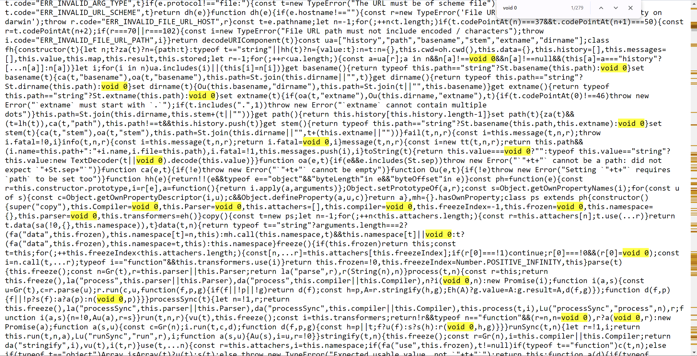

# Toán tử void là gì?

Mục lục

* [Toán tử void là gì?](toan-tu-void-la-gi.md#toan-tu-void-la-gi)
* [Một số ứng dụng của void](toan-tu-void-la-gi.md#mot-so-ung-dung-cua-void)
  * [Tránh kết quả trả về ngoài ý muốn](toan-tu-void-la-gi.md#tranh-ket-qua-tra-ve-ngoai-y-muon)
  * [Ngăn chặn hành động mặc định của liên kết](toan-tu-void-la-gi.md#ngan-chan-hanh-dong-mac-dinh-cua-lien-ket)
  * [An toàn hơn khi làm việc với undefined](toan-tu-void-la-gi.md#an-toan-hon-khi-lam-viec-voi-undefined)

### Toán tử void là gì?

Toán tử `void` (_Ý nghĩa: không có giá trị_) được sử dụng để đánh giá một biểu thức và luôn trả về giá trị `undefined`, bất kể biểu thức đó là gì. Nói cách khác, `void` cho phép bạn thực thi một biểu thức mà không quan tâm đến kết quả của nó, thay vào đó nó luôn trả về giá trị `undefined`.

**Cú pháp:**

```js
void expression; // undefined
```

**Ví dụ:**

```javascript
console.log(void 0); // undefined
console.log(void (2 + 2)); // undefined

function sum(a, b) {
  return a + b;
}

console.log(void sum(2, 3)); // undefined
```

***

### Một số ứng dụng của void

#### Tránh kết quả trả về ngoài ý muốn

Khi bạn muốn thực thi một biểu thức mà không quan tâm đến kết quả trả về, bạn có thể dùng `void` để đảm bảo kết quả luôn là `undefined`.

#### Ngăn chặn hành động mặc định của liên kết

`void` thường được sử dụng trong các thẻ `<a>` để ngăn chặn hành động mặc định (_chẳng hạn như chuyển hướng trang_):

```html
<a href="javascript:void(0);">Click me</a>
```

Khi nhấp vào liên kết này, trang sẽ không bị chuyển hướng hay tải lại trang vì kết quả của `javascript:void(0)` là `undefined`, không dẫn đến hành động nào.

> Thực tế thì trường hợp này thay các giá trị khác `undefined` vào vẫn ngăn chặn hành vi mặc định (_trừ giá trị là chuỗi_). Tuy nhiên, theo quy ước thì `void(0)` được sử dụng bởi nó tường minh, dễ hiểu và ngắn gọn.

#### An toàn hơn khi làm việc với undefined

`undefined` trong JavaScript có thể bị ghi đè, dẫn đến các hành vi không mong muốn. Sử dụng `void 0` luôn trả về giá trị `undefined`, đảm bảo rằng bạn không gặp phải các tình huống không mong đợi do `undefined` bị thay đổi.

```javascript
function isUndefined(value) {
  return value === void 0;
}

const colors = ['red'];

console.log(isUndefined(colors[9])); // true

```

**Tại sao không dùng void 1, void true, hay void bất\_kỳ\_gì khác?**

Không có lý do kỹ thuật nào ngăn cản bạn sử dụng `void 1`, `void true`, hay bất kỳ giá trị nào khác thay cho `0`. Tuy nhiên, `void 0` đã trở thành tiêu chuẩn và được sử dụng phổ biến bởi vì nó đơn giản, dễ hiểu, và dễ nhận biết.

Thậm chí, các thư viện “minify” code bằng cách thay thế `undefined` bằng `void 0`:

<figure><figcaption></figcaption></figure>

Điều này mang lại 2 lợi ích chính:

* Đảm bảo tính chính xác khi cần so sánh với `undefined`
* Giảm dung lượng bởi số ký tự của `void 0` ngắn hơn `undefined`


Tóm tắt

* **`void` trong JavaScript**: `void` là từ khóa dùng để đánh giá một biểu thức và luôn trả về giá trị `undefined`, không quan tâm đến kết quả của biểu thức đó.
* **Ứng dụng của `void`**:
  * **Tránh kết quả trả về ngoài ý muốn**: Sử dụng `void` để đảm bảo kết quả luôn là `undefined`.
  * **Ngăn chặn hành động mặc định của liên kết**: `void` có thể được dùng trong thẻ `<a>` để ngăn chặn hành động mặc định như chuyển hướng trang.
  * **An toàn hơn khi làm việc với `undefined`**: `void 0` luôn trả về `undefined`, tránh các tình huống không mong muốn nếu `undefined` bị ghi đè.


