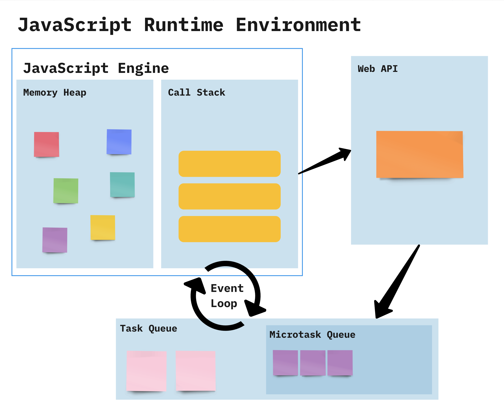

# Thứ tự thực thi trong JavaScript

Mục lục

* [Đặc tính của JavaScript](thu-tu-thuc-thi-trong-javascript.md#dac-tinh-cua-javascript)
* [Các thành phần trong JavaScript khi xử lý tác vụ](thu-tu-thuc-thi-trong-javascript.md#cac-thanh-phan-trong-javascript-khi-xu-ly-tac-vu)
  * [Call Stack](thu-tu-thuc-thi-trong-javascript.md#call-stack)
  * [Web APIs](thu-tu-thuc-thi-trong-javascript.md#web-apis)
  * [Microtask Queue](thu-tu-thuc-thi-trong-javascript.md#microtask-queue)
  * [Task Queue (Macrotask Queue)](thu-tu-thuc-thi-trong-javascript.md#task-queue-macrotask-queue)
  * [Event Loop](thu-tu-thuc-thi-trong-javascript.md#event-loop)
* [Thứ tự thực thi](thu-tu-thuc-thi-trong-javascript.md#thu-tu-thuc-thi)
* [Ví dụ](thu-tu-thuc-thi-trong-javascript.md#vi-du)

JavaScript là ngôn ngữ đơn luồng, không đồng bộ

### Đặc tính của JavaScript

1. **Đơn luồng**: JavaScript thực thi từng đoạn mã một trên luồng chính duy nhất (main thread).
2. **Không đồng bộ**: JavaScript xử lý các tác vụ bất đồng bộ (ví dụ: `setTimeout`, `fetch`) mà không chặn luồng chính. Các tác vụ này được giao cho **Web APIs** để trình duyệt xử lý, và JavaScript chỉ nhận kết quả từ trình duyệt khi chúng hoàn thành.

***

### Các thành phần trong Javascript khi xử lý tác vụ

#### Call Stack

* Call Stack là một cấu trúc dữ liệu được JavaScript sử dụng để:
  * Theo dõi các lệnh gọi hàm.
  * Thực thi mã **đồng bộ**.
* Hoạt động: Tuân theo nguyên tắc **LIFO (Last-In-First-Out)**:
  * Hàm được **push** vào stack khi được gọi.
  * Hàm được **pop** ra khỏi stack khi thực thi xong.

Ví dụ:

```javascript
function foo() {
  console.log("Foo");
}
function bar() {
  foo();
  console.log("Bar");
}
bar();

```

Thứ tự thực thi:

1. `bar()` được **push** vào stack.
2. Trong `bar()`, `foo()` được gọi và **push** vào stack.
3. `foo()` thực thi, log "Foo", sau đó **pop** ra khỏi stack.
4. `bar()` tiếp tục thực thi, log "Bar", sau đó **pop** ra khỏi stack.

***

#### Web Apis

* Web APIs xử lý các tác vụ bất đồng bộ, như:
  * Timers: `setTimeout`, `setInterval`.
  * Network requests: `fetch`, `XMLHttpRequest`.
  * Event listeners: Lắng nghe các sự kiện DOM.
* Khi các tác vụ hoàn thành, Web APIs chuyển callback tới **Task Queue** hoặc **Microtask Queue** để xử lý.

***

#### Microtask Queue

* Microtask Queue lưu trữ các tác vụ như:
  * Promises (`.then`, `.catch`, `.finally`).
  * `queueMicrotask`.
* Thứ tự xử lý:
  * Microtasks được xử lý ngay sau khi **Call Stack** trống, trước **Task Queue**.

***

#### Task Queue (Macrotask Queue)

* Task Queue lưu trữ các macro tasks, như:
  * `setTimeout`, `setInterval`.
  * DOM events (ví dụ: `click`, `resize`).
  * `setImmediate` (Node.js).
* **T**hứ tự xử lý:
  * Sau khi **Call Stack** trống và tất cả **Microtasks** đã hoàn thành.

***

#### Event Loop

Event Loop đảm bảo thứ tự thực thi đúng:

1. Thực thi mã đồng bộ (Call Stack).
2. Xử lý tất cả các **Microtasks** (Microtask Queue).
3. Xử lý tác vụ đầu tiên trong **Task Queue**.

Các bước Event Loop:

1. Thực thi tất cả mã đồng bộ (Call Stack).
2. Xử lý tất cả Microtasks (Microtask Queue).
3. Thực thi tác vụ từ Task Queue (Macrotask Queue).
4. Lặp lại quy trình.

### Thứ tự thực thi

<table><thead><tr><th width="163">Step</th><th>Thành phần thực hiện</th><th>Loại công việc</th><th>Mô tả</th></tr></thead><tbody><tr><td>Synchronous Code</td><td>Call Stack</td><td>Synchronous</td><td>Thực hiện ngay lập tức.</td></tr><tr><td>Microtasks</td><td>Microtask Queue</td><td>Promises, queueMicrotask</td><td>Xử lý ngay sau khi Call Stack trống, trước Task Queue.</td></tr><tr><td>Macrotasks</td><td>Task Queue</td><td>Timers, Events</td><td>Xử lý sau khi tất cả Microtasks đã được thực hiện.</td></tr></tbody></table>

### Ví dụ

```javascript
console.log("Start"); // Synchronous

setTimeout(() => {
  console.log("setTimeout 1"); // Macrotask
}, 0);

Promise.resolve()
  .then(() => {
    console.log("Promise 1"); // Microtask
    return Promise.resolve();
  })
  .then(() => {
    console.log("Promise 2"); // Microtask
  });

setTimeout(() => {
  console.log("setTimeout 2"); // Macrotask
}, 0);

console.log("End"); // Synchronous

```

Luồng thực hiện:

1. Call Stack:
   * `console.log("Start")`: Thực thi ngay, log "Start".
   * `setTimeout`: Callback được gửi tới Web API.
   * `Promise.resolve`: Tạo Microtask.
   * `console.log("End")`: Thực thi ngay, log "End".
2. Microtask Queue:
   * `Promise 1`: Log "Promise 1".
   * `Promise 2`: Log "Promise 2".
3.  Task Queue (Macrotasks):

    * `setTimeout 1`: Log "setTimeout 1".
    * `setTimeout 2`: Log "setTimeout 2".


Kết quả cuối cùng:

```javascript
Start
End
Promise 1
Promise 2
setTimeout 1
setTimeout 2

```

<figure><figcaption><p>jjavascript visualized runtime</p></figcaption></figure>


Tóm tắt

* **JavaScript là đơn luồng và không đồng bộ**: xử lý từng đoạn mã một trong luồng chính, trong khi các tác vụ bất đồng bộ được xử lý ngoài luồng chính qua Web APIs.
* **Call Stack**: Thực thi mã đồng bộ theo nguyên tắc **LIFO**.
* **Web APIs**: Xử lý các tác vụ bất đồng bộ và chuyển callback vào hàng đợi.
* **Microtask Queue**: Xử lý các **Promises** và được ưu tiên trước **Task Queue**.
* **Task Queue**: Xử lý các **Macrotasks**, như `setTimeout`.
* **Event Loop**: Đảm bảo Call Stack, Microtasks, và Task Queue được xử lý theo thứ tự đúng:
  1. Mã đồng bộ (Call Stack).
  2. Microtasks (Microtask Queue).
  3. Macrotasks (Task Queue).


