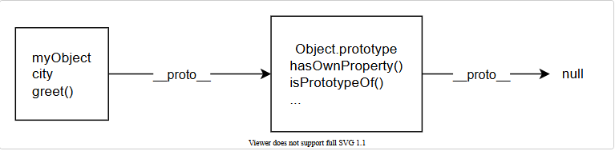
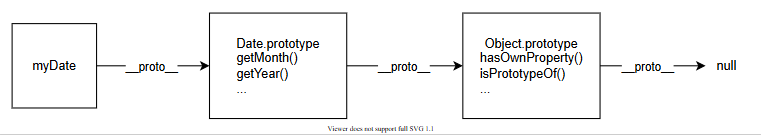

# Object prototypes

Mục lục

* [Object prototypes là gì ?](object-prototypes.md#object-prototypes-la-gi)
  * [Prototype của một đối tượng](object-prototypes.md#prototype-cua-mot-doi-tuong)
  * [Prototype chain](object-prototypes.md#prototype-chain)
  * [Shadowing properties](object-prototypes.md#shadowing-properties)
* [Thay đổi Prototype](object-prototypes.md#thay-doi-prototype)
  * [Sử dụng Object.create](object-prototypes.md#su-dung-object.create)
  * [Sử dụng Constructor](object-prototypes.md#su-dung-contructor)
* [Sự khác nhau giữa in và Object.hasOwn](object-prototypes.md#su-khac-nhau-giua-in-va-object.hasown)
  * [Operator in](object-prototypes.md#operator-in)
  * [Object.hasOwn](object-prototypes.md#object.hasown)
  * [So sánh in và Object.hasOwn](object-prototypes.md#so-sanh-in-va-object.hasown)
  * [Khi nào nên sử dụng in/Object.hasOwn ?](object-prototypes.md#khi-nao-nen-su-dung-in-object.hasown)
* [Ứng dụng của Prototype](object-prototypes.md#ung-dung-cua-prototype)

### Object prototypes là gì ?

Trong JavaScript, **prototype** là một cơ chế cốt lõi hỗ trợ **kế thừa** các thuộc tính và phương thức giữa các đối tượng. Mỗi đối tượng trong JavaScript đều có một liên kết tới một đối tượng khác, được gọi là **prototype**.

#### Prototype của một đối tượng

Khi một đối tượng được tạo, nó sẽ có một liên kết tới prototype của constructor (hàm khởi tạo) đã tạo ra nó.

Ví dụ:

```javascript
function Person(name) {
  this.name = name;
}

Person.prototype.sayHello = function () {
  console.log(`Hello, my name is ${this.name}`);
};

const person1 = new Person("Tuan");
person1.sayHello(); // Output: Hello, my name is Tuan
```

Trong ví dụ trên:

* `Person.prototype` là prototype của tất cả các đối tượng được tạo bởi hàm khởi tạo `Person`.
* `person1` có thể truy cập phương thức `sayHello` thông qua prototype.

#### Prototype chain

Prototype chain là cơ chế quan trọng trong JavaScript, cho phép các đối tượng kế thừa thuộc tính và phương thức từ **prototype** của chúng. Mọi đối tượng đều có một **prototype** (trừ `Object.prototype`), và quá trình tìm kiếm thuộc tính sẽ duyệt qua **prototype chain**.

**Các khái niệm chính**:

1. **Prototype** là một đối tượng mà một đối tượng khác có thể kế thừa.
2. **Prototype Chain** là chuỗi kết nối các prototype từ đối tượng hiện tại đến `Object.prototype`.

**Cơ chế tìm kiếm trong prototype chain:**

1. JavaScript tìm kiếm thuộc tính trong chính đối tượng.
2. Nếu không tìm thấy, tiếp tục tìm kiếm trong prototype.
3. Nếu vẫn không tìm thấy, tìm tiếp trong prototype của prototype.
4. Nếu đến cuối chuỗi mà không tìm thấy, trả về `undefined`.

Ví dụ:

```javascript
const myObject = {
  city: "Madrid",
  greet() {
    console.log(`Greetings from ${this.city}`);
  },
};

myObject.greet(); // Greetings from Madrid
myObject.toString(); // "[object Object]"
```

Phân tích:

* `greet` là thuộc tính của `myObject`.
* `toString` không nằm trong `myObject` mà là một phương thức thuộc **Object.prototype.** Nó được truy cập thông qua **prototype chain**.

<figure><figcaption><p>Sơ đồ minh hoạ quá trình tìm kiếm thuộc tính</p></figcaption></figure>

Ví dụ khác về Prototype Chain:

```javascript
const myDate = new Date();
let object = myDate;

do {
  object = Object.getPrototypeOf(object);
  console.log(object);
} while (object);

// Date.prototype: {constructor: ƒ, ...}
// Object { }
// null
```

**Output:**

* `Date.prototype`
* `Object { }`
* `null`

**Phân tích:**

* `myDate` có prototype là `Date.prototype`.
* `Date.prototype` lại có prototype là `Object.prototype`.
* `Object.prototype` không có prototype, nên kết thúc với `null`.

<figure><figcaption><p>Sơ đồ minh hoạ quá trình tìm kiếm prototype</p></figcaption></figure>

Phương thức `getPrototypeOf` trong ví dụ trên dùng để trỏ đến prototype của đối tượng, ngoài getPrototypeOf có thể dùng `__proto__` , tuy nhiên `__proto__` không được khuyến khích sử dụng.

**Cơ chế kế thừa:**

* Khi một đối tượng được tạo ra, nó sẽ tự động kế thừa các thuộc tính và phương thức từ prototype tương ứng với kiểu dữ liệu của nó.
* `Object.prototype` nằm ở đỉnh của prototype chain, các đối tượng Number, String, Array,... đều được kế thừa `Object.prototype`.

Ví dụ:

```javascript
console.log(new String("abc").__proto__ === String.prototype); // true
console.log(new Boolean(true).__proto__ === Boolean.prototype); // true
console.log(new Number(123).__proto__ === Number.prototype); // true
console.log(new Number(123).__proto__.__proto__ === Object.prototype); // true
console.log(new String("abc").__proto__.__proto__ === Object.prototype); // true
console.log(new Boolean(true).__proto__.__proto__ === Object.prototype); // true
```

* Các đối tượng String/Boolean/Number... được kế thừa prototype tương ứng theo kiểu dữ liệu(dòng 1, 2, 3)
* Prototype của các đối tượng String/Boolean/Number... được kế thừa từ prototype Object(dòng 3, 4, 5).

Ngoài ra kiểu dữ liệu nguyên thuỷ không có prototype nhưng nhờ cơ chế autoboxing([Xem chi tiết ở bài Cơ chế Autoboxing](co-che-autoboxing.md)) nên chúng có prototype tạm thời.

Ví dụ:

```javascript
console.log("123".__proto__ === String.prototype); // true
console.log(true.__proto__ === Boolean.prototype); // true
console.log((123).__proto__ === Number.prototype); // true
```

Null và undefined không có prototype.

Ví dụ:

```javascript
console.log(null.__proto__); // Uncaught TypeError: Cannot read properties of null (reading '__proto__')
console.log(undefined.__proto__); // Uncaught TypeError: Cannot read properties of undefined (reading '__proto__')
```

Chính vì Object.prototype được nằm  ở đỉnh  trong prototype chain nên mọi phương thức, thuộc tính được định nghĩa ở Object.prototype được kế thừa ở tất cả các đối tượng.

Ví dụ:

```javascript
Object.prototype.sayHello = function () {
  console.log("Hello");
};

"123".sayHello(); // Hello
(123).sayHello(); // Hello
true.sayHello(); // Hello
({}).sayHello(); // Hello
```

* Phương thức sayHello được định nghĩa ở Object.prototype nên các đối tượng có thể gọi hàm đó(trong ví dụ trên sử dụng kiểu dữ liệu nguyên thuỷ tuy nhiên nhờ có autoboxing nên chúng vẫn có đối tượng nên vẫn có được prototype).

Ví dụ khác:

<pre class="language-javascript"><code class="lang-javascript">Function.prototype.sayHello = function () {
  console.log("Hello");
};

<strong>"123".sayHello(); // Uncaught TypeError: "123".sayHello is not a function
</strong>Object.sayHello(); // Hello
</code></pre>

* "123".sayHello(); Vì chuỗi "123" có autoboxing sẽ có đối tượng tạm thời và được kế thừa String.prototype và Object.prototype nhưng sayHello nằm trong Function.prototype nên xuất hiện lỗi.
* Object.sayHello(); in ra chuỗi Hello vì Object là một hàm tạo(function constructor) nên nó kế thừa  Function.prototype&#x20;

Trong prototype của đối tượng sẽ có thuộc tính `constructor` là thuộc tính trỏ về hàm khởi tạo ban đầu của một đối tượng.

Ví dụ:

```javascript
function Character(name) {
  this.name = name;
}
const john = new Character("John");
console.log( john.__proto__.constructor === Character); // true
```

> Có thể sử dụng \_\_proto\_\_.constructor để kiểm tra xem đối tượng do hàm tạo nào tạo ra.

Ngoài `__proto__.constructor` có thể dùng `instanceof` để kiểm tra đối tượng thuộc hàm tạo nào

Ví dụ:

```javascript
console.log(john instanceof Character); // true
```

Tuy nhiên `instanceof` hoạt động không hoàn toàn giống \_\_proto\_\_, instanceof  sẽ kiểm tra toàn prototype chain để tìm hàm tạo, trong khi đó \_\_proto\_\_ chỉ trỏ đến hàm tạo ra đối tượng.

Ví dụ:

```javascript
const str = new String("abc");
console.log(str.__proto__ === String.prototype); // true
console.log(str.__proto__ === Object.prototype); // false
console.log(str instanceof Object); // true
console.log(str instanceof String); // true
```

* Biến str được tạo từ hàm tạo String nên nếu dùng `__proto__` để kiểm tra thì String trả về true còn với Object trả về false
* Biến str được kế thừa String.prototype và Object.prototype nên kiểm tra `instanceof` với hàm tạo String và Object đều trả về true.

Ngoài ra `instanceof` chỉ kiểm tra hàm tạo cho những giá trị là đối tượng

Ví dụ:

```javascript
console.log("Hello" instanceof String); // false
console.log("Hello".__proto__ === String.prototype); // true
console.log(new String("Hello") instanceof String); // true
```

* `"Hello"` là giá trị nguyên thủy, không phải instance của `String`.
* `new String("Hello")` là một đối tượng (wrapper) nên kết quả là `true`.

Ví dụ khác so sánh `instanceof` và `__proto__`

```javascript
function Parent() {}
function Child() {}
Child.prototype = new Parent();
const instance = new Child();

console.log(instance instanceof Child); // true
console.log(instance instanceof Parent); // true
console.log(instance.__proto__ === Child.prototype); // true
console.log(instance.__proto__ === Parent.prototype); // false
console.log(instance.__proto__.__proto__ === Parent.prototype); // true
```

#### Shadowing properties

Khi một thuộc tính được khai báo trực tiếp trên một đối tượng, nó sẽ **"che khuất"** (shadow) thuộc tính cùng tên trong prototype.

Ví dụ:

```javascript
const myDate = new Date(1995, 11, 17);

console.log(myDate.getTime()); // 819129600000

myDate.getTime = function () {
  console.log("something else!");
};

myDate.getTime(); // 'something else!'
```

* `getTime` ban đầu là một phương thức của `Date.prototype`.
* Khi thêm một phương thức `getTime` trực tiếp vào `myDate`, phiên bản mới này sẽ được gọi thay vì phương thức trong prototype.

Điều này được gọi là "shadowing" của thuộc tính.

***

### Thay đổi Prototype

#### Sử dụng Object.create

`Object.create()` tạo một đối tượng mới và cho phép chỉ định prototype cho đối tượng đó.

Ví dụ:

```javascript
const personPrototype = {
  greet() {
    console.log("hello!");
  },
};

const carl = Object.create(personPrototype);
carl.greet(); // hello!
```

* `carl` được tạo với prototype là `personPrototype`.
* Phương thức `greet` được kế thừa từ prototype.

#### Sử dụng Constructor

Trong JavaScript, tất cả các hàm đều có một thuộc tính `prototype`. Khi gọi hàm như một constructor, thuộc tính `prototype` được đặt làm prototype của đối tượng mới.

Ví dụ:

```javascript
function Person(name) {
  this.name = name;
}

Person.prototype.greet = function () {
  console.log(`hello, my name is ${this.name}!`);
};

const reuben = new Person("Reuben");
reuben.greet(); // hello, my name is Reuben!
```

Sau đoạn mã này, các đối tượng được tạo bằng Person() sẽ lấy `Person.prototype` làm nguyên mẫu, tự động chứa phương thức greet.

***

### Sự khác nhau giữa in và Object.hasOwn

#### Operator in

* Toán tử `in` kiểm tra xem một thuộc tính có tồn tại trong đối tượng hoặc bất kỳ đối tượng nào trong chuỗi **prototype chain** của nó.
* Điều này có nghĩa là nếu thuộc tính nằm trong prototype của đối tượng, `in` vẫn trả về `true`.

Ví dụ:

```javascript
const obj = { name: 'Tuan' };
console.log('name' in obj); // true (thuộc tính nằm trực tiếp trên obj)

const proto = { age: 30 };
Object.setPrototypeOf(obj, proto);

console.log('age' in obj); // true (thuộc tính nằm trong prototype của obj)
console.log('toString' in obj); // true (thuộc tính trong Object.prototype)
```

#### Object.hasOwn

* `Object.hasOwn(obj, property)` chỉ kiểm tra xem thuộc tính có nằm **trực tiếp** trên đối tượng hay không (không xét trong prototype chain).
* Thuộc tính được thừa kế từ prototype sẽ không được tính.

Ví dụ:

```javascript
const obj = { name: 'Tuan' };
console.log(Object.hasOwn(obj, 'name')); // true (thuộc tính nằm trực tiếp trên obj)

const proto = { age: 30 };
Object.setPrototypeOf(obj, proto);

console.log(Object.hasOwn(obj, 'age')); // false (thuộc tính nằm trong prototype của obj)
console.log(Object.hasOwn(obj, 'toString')); // false (thuộc tính nằm trong Object.prototype)

```

#### So sánh in và Object.hasOwn

<table data-header-hidden><thead><tr><th width="247"></th><th></th><th></th></tr></thead><tbody><tr><td><strong>Đặc điểm</strong></td><td><strong><code>in</code></strong></td><td><strong><code>Object.hasOwn</code></strong></td></tr><tr><td><strong>Kiểm tra trong prototype chain</strong></td><td>Có (kiểm tra cả đối tượng và chuỗi prototype).</td><td>Không (chỉ kiểm tra thuộc tính trực tiếp).</td></tr><tr><td><strong>Kết quả khi thuộc tính trên prototype</strong></td><td><code>true</code></td><td><code>false</code></td></tr><tr><td><strong>Hỗ trợ kiểm tra <code>null</code>/<code>undefined</code></strong></td><td>Sẽ lỗi nếu đối tượng là <code>null</code> hoặc <code>undefined</code>.</td><td>Trả lỗi rõ ràng nếu đối tượng là <code>null</code> hoặc <code>undefined</code>.</td></tr><tr><td><strong>Ví dụ sử dụng thực tế</strong></td><td>Kiểm tra <strong>tất cả</strong> thuộc tính (kể cả thừa kế).</td><td>Kiểm tra thuộc tính <strong>chỉ có</strong> trên đối tượng.</td></tr></tbody></table>

#### Khi nào nên sử dụng in/Object.hasOwn ?

**Sử dụng `in`**:

* Khi bạn cần kiểm tra xem một thuộc tính có tồn tại bất kỳ đâu (bao gồm cả prototype chain).
* Thường dùng để kiểm tra các thuộc tính hoặc phương thức được thừa kế từ prototype, như `toString`.

**Sử dụng `Object.hasOwn`**:

* Khi bạn chỉ quan tâm đến các thuộc tính **trực tiếp** thuộc về đối tượng (không xét thừa kế).
* Dùng khi bạn muốn đảm bảo không bị ảnh hưởng bởi các thuộc tính từ prototype.

***

### Ứng dụng của Prototype

* **Kế thừa phương thức chung:**
  * Giảm thiểu việc sao chép logic giữa các đối tượng.
  * Các phương thức dùng chung như `toString` hoặc `valueOf` được định nghĩa trên `Object.prototype`.
* **Tạo cấu trúc đối tượng linh hoạt:**
  * Prototype cho phép mở rộng tính năng mà không cần sửa đổi trực tiếp từng đối tượng.
* **Tăng hiệu quả bộ nhớ:**
  * Các phương thức được lưu trữ ở một nơi (trong prototype) thay vì sao chép vào từng đối tượng.


Tóm tắt

* **Object Prototype là gì?**
  * Cơ chế giúp đối tượng kế thừa thuộc tính và phương thức từ các đối tượng khác.
  * Mỗi đối tượng đều có liên kết đến prototype của constructor đã tạo ra nó.
* **Prototype của một đối tượng:**
  * Prototype chứa các phương thức hoặc thuộc tính chung để các đối tượng có thể chia sẻ.
  *   Ví dụ:

      ```javascript
      javascriptSao chép mãfunction Person(name) {
        this.name = name;
      }
      Person.prototype.sayHello = function () {
        console.log(`Hello, my name is ${this.name}`);
      };
      ```
* **Prototype chain (Chuỗi nguyên mẫu):**
  * JavaScript sẽ tìm thuộc tính qua các prototype liên kết nếu không có trong đối tượng hiện tại.
  * Chuỗi này kết thúc khi gặp `null`.
* **Shadowing properties (Ghi đè thuộc tính):**
  * Khi đối tượng có thuộc tính trùng tên với thuộc tính trong prototype, thuộc tính của đối tượng sẽ được ưu tiên.
  *   Ví dụ:

      ```javascript
      javascriptSao chép mãconst obj = new Date();
      obj.toString = function () {
        return "shadowed!";
      };
      console.log(obj.toString()); // "shadowed!"
      ```
* **Thay đổi Prototype:**
  * Sử dụng `Object.create()` để tạo đối tượng với một prototype cụ thể.
  * Sử dụng constructor để tạo đối tượng với prototype mặc định.
* **So sánh `in` và `Object.hasOwn`:**
  * `in`: Kiểm tra thuộc tính tồn tại ở bất kỳ đâu trong prototype chain.
  * `Object.hasOwn`: Chỉ kiểm tra thuộc tính có trực tiếp trên đối tượng.
* **Ứng dụng của Prototype:**
  * **Kế thừa:** Chia sẻ logic chung giữa các đối tượng, giảm thiểu sao chép.
  * **Mở rộng:** Dễ dàng thêm phương thức hoặc thuộc tính cho tất cả các đối tượng.

