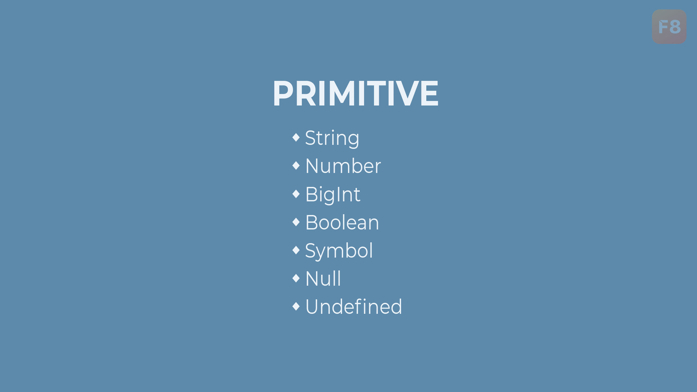
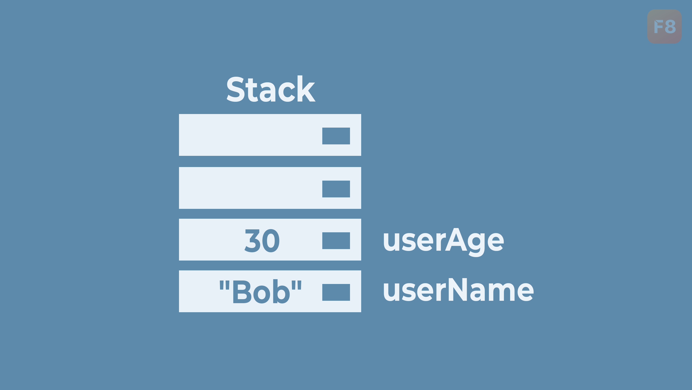
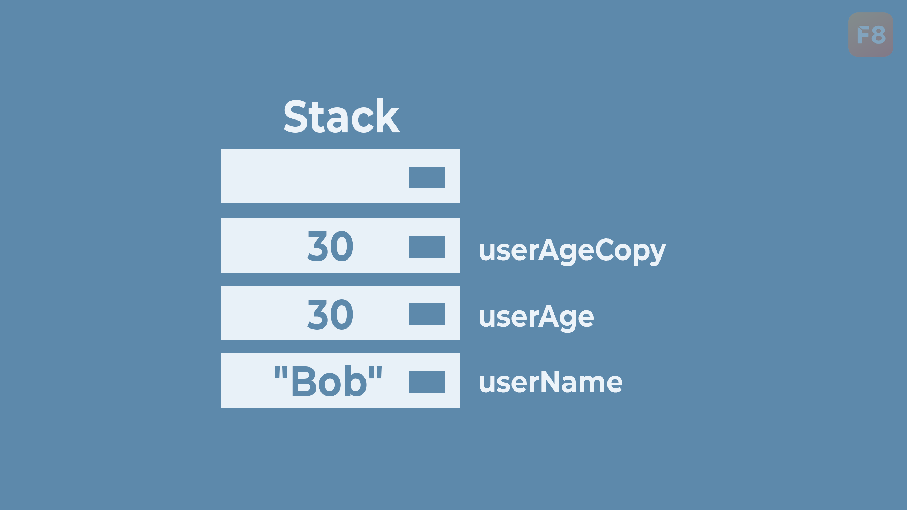
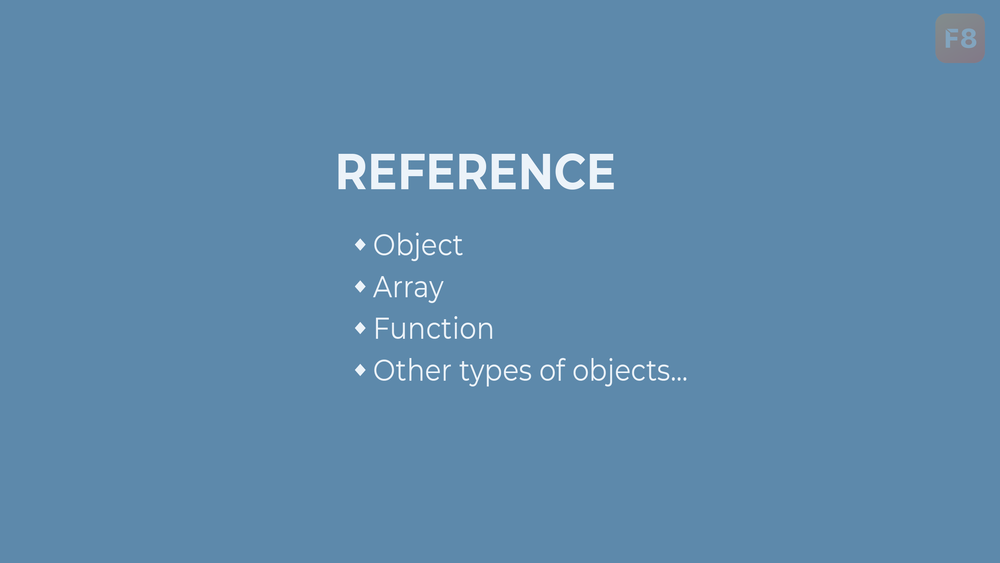
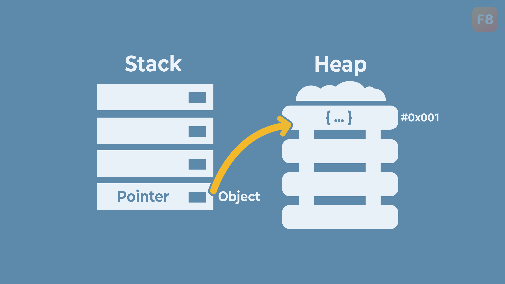
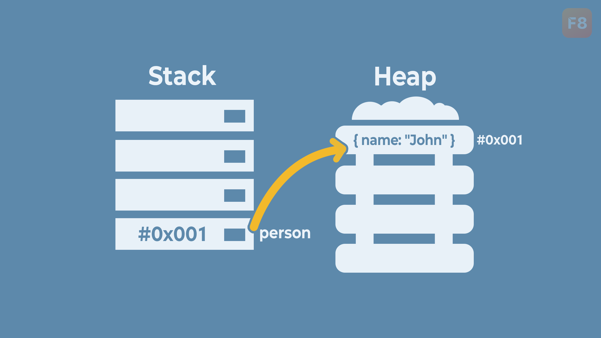
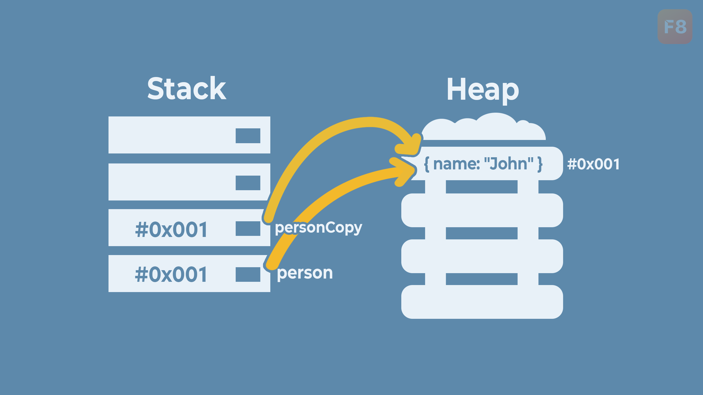
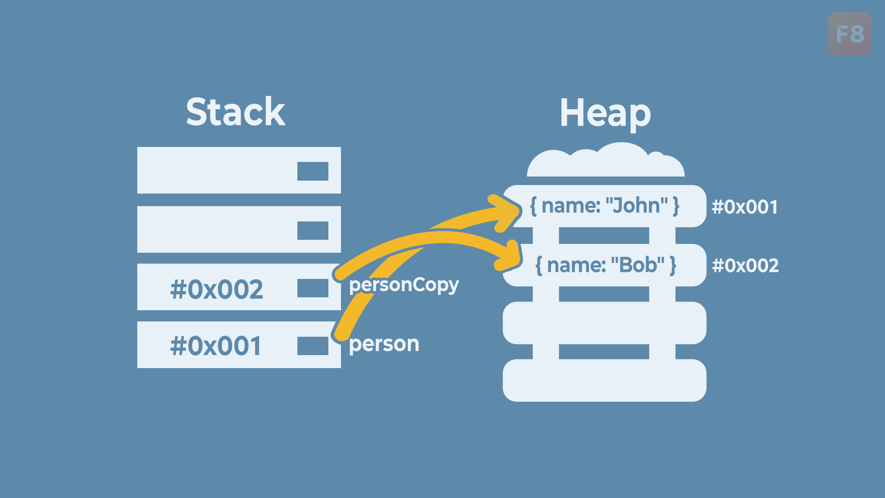
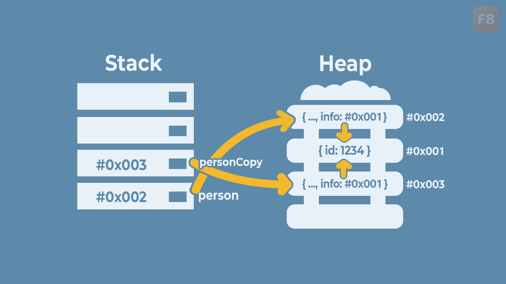
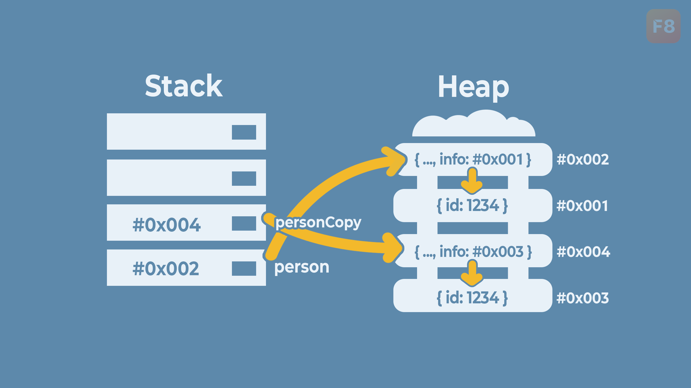

# Primitive và Reference types

Mục lục

* [Primitive types](primitive-va-reference-types.md#primitive-types)
  * [Primitive types là gì?](primitive-va-reference-types.md#primitive-types-la-gi)
  * [Cách Primitive types được lưu trữ](primitive-va-reference-types.md#cach-primitive-types-duoc-luu-tru)
  * [Ưu điểm khi sử dụng Primitive types?](primitive-va-reference-types.md#uu-diem-khi-su-dung-primitive-types)
  * [Primitive types là bất biến](primitive-va-reference-types.md#primitive-types-la-bat-bien)
* [Reference types](primitive-va-reference-types.md#reference-types)
  * [Reference types là gì?](primitive-va-reference-types.md#reference-types-la-gi)
  * [Cách Reference types được lưu trữ](primitive-va-reference-types.md#cach-reference-types-duoc-luu-tru)
  * [Tại sao cần sử dụng Reference types?](primitive-va-reference-types.md#tai-sao-can-su-dung-reference-types)
* [So sánh Primitive và Reference types](primitive-va-reference-types.md#so-sanh-chi-tiet)
  * [So sánh chi tiết](primitive-va-reference-types.md#so-sanh-chi-tiet)
  * [Bảng so sánh nhanh](primitive-va-reference-types.md#bang-so-sanh-nhanh)
* [Các sai lầm thường gặp](primitive-va-reference-types.md#cac-sai-lam-thuong-gap)
  * [So sánh trực tiếp hai đối tượng](primitive-va-reference-types.md#so-sanh-truc-tiep-hai-doi-tuong)
  * [Không hiểu rõ về tính chất tham chiếu](primitive-va-reference-types.md#khong-hieu-ro-ve-tinh-chat-tham-chieu)

### Primitive types

<figure><figcaption></figcaption></figure>

#### Primitive types là gì?

Trong JavaScript, các kiểu dữ liệu nguyên thủy (_primitive types_) bao gồm: `string`, `number`, `bigint`, `boolean`, `symbol`, `null` và `undefined`. Đây là những kiểu dữ liệu mà giá trị của chúng chỉ chứa một giá trị đơn giản và không phải là một đối tượng.

**Cú pháp sử dụng:** không cần cú pháp đặc biệt, chỉ cần gán giá trị cho biến.

Ví dụ:

```js
let name = "John"; // string
let age = 25; // number
let isStudent = false; // boolean
```

#### Cách Primitive types được lưu trữ

Các giá trị nguyên thủy được lưu trực tiếp tại vị trí bộ nhớ mà biến chỉ đến, không giống như _reference types_ (chỉ lưu địa chỉ tham chiếu đến nơi chứa dữ liệu thực tế).

Ví dụ: Khi khai báo một biến kiểu nguyên thủy.

```js
let userName = "Bob";
let userAge = 25;
```

Giá trị `"Bob"` và `25` được lưu trực tiếp tại vị trí bộ nhớ của biến `userName` và `userAge`.

<figure><figcaption></figcaption></figure>

Tiếp theo, sửa giá trị của biến `userAge`:

```js
userAge = 30; // Sửa 25 thành 30
```

<figure><figcaption></figcaption></figure>

Biến `userAge` được sửa thành `30`, giá trị `30` được thay thế vào vị trí bộ nhớ của biến.

Tạo ra biến `userAgeCopy` từ `userAge`:

```js
let userAgeCopy = userAge;
```

<figure><figcaption></figcaption></figure>

Sửa giá trị của `userAgeCopy` thành `35`:

```js
userAgeCopy = 35;
```

Kết quả, biến `userAgeCopy` chứa `35` và `userAge` vẫn là `30`:

Các giá trị nguyên thủy được lưu trực tiếp tại vị trí bộ nhớ mà biến chỉ đến, nên việc sửa biến copy sẽ chỉ thay đổi giá trị của biến copy mà không ảnh hưởng tới biến ban đầu.

#### Ưu điểm khi sử dụng Primitive types?

* **Hiệu suất cao hơn**: Vì giá trị được lưu trực tiếp trong vị trí bộ nhớ của biến, việc truy cập và xử lý dữ liệu nhanh chóng.
* **So sánh giá trị dễ dàng**: Khi so sánh 2 giá trị nguyên thủy, JavaScript sẽ so sánh giá trị thực tế của chúng, đảm bảo tính chính xác.

Ví dụ: Dễ dàng so sánh 2 giá trị nguyên thủy.

```js
let string1 = "hello";
let string2 = "hello";

console.log(string1 === string2); // true
```

#### Primitive types là bất biến

Trong JavaScript, các giá trị nguyên thủy là bất biến (_immutable_). Điều này có nghĩa là một khi một giá trị nguyên thủy được tạo, giá trị đó không thể thay đổi.

Ví dụ: Không thể sửa được một chuỗi

```javascript
let str = "hello";
str[0] = "ABC";

console.log(str); // hello
```

Sự bất biến của giá trị nguyên thủy giúp đảm bảo tính toàn vẹn của dữ liệu và giúp chúng ta dễ dàng kiểm soát các thay đổi dữ liệu trong chương trình.

***

### Reference types

<figure><figcaption></figcaption></figure>

#### Reference types là gì?

Kiểu tham chiếu (_Reference types_) trong JavaScript bao gồm các kiểu dữ liệu như `object`, `array`, `function`, và các đối tượng khác. Khác với kiểu dữ liệu nguyên thủy, kiểu tham chiếu lưu trữ địa chỉ (_tham chiếu_) của giá trị trong bộ nhớ, thay vì giá trị thực tế.

Ví dụ:

```js
let person = { name: "John", age: 25 };
let numbers = [1, 2, 3, 4, 5];
function sum(a, b) {
  return a + b;
};
```

Biến `person`, `numbers` và `sum` thực chất chỉ lưu trữ địa chỉ tham chiếu tới giá trị trong bộ nhớ _Heap_, chứ không trực tiếp lưu trữ chúng.

<figure><figcaption></figcaption></figure>

#### Cách Reference types được lưu trữ

Ví dụ: Tạo object `person`.

```js
let person = {
  name: "John"
};
```

<figure><figcaption></figcaption></figure>

Tạo biến `personCopy` từ `person`.

```js
let personCopy = person;
```

<figure><figcaption></figcaption></figure>

Lúc này, cả `person` và `personCopy` đều tham chiếu tới cùng một object nên sửa một biến sẽ thấy sự thay đổi thông qua cả biến còn lại.

Ví dụ:

```javascript
let person = {
  name: "John"
};
let personCopy = person;

personCopy.name = "Bob";

console.log(personCopy.name); // Bob
console.log(person.name); // Bob
```

<figure><figcaption></figcaption></figure>

Đó chính là lý do tại sao chúng ta cần sử dụng `Object.assign()` để copy thuộc tính sang một object mới.

Ví dụ:

```javascript
let person = {
  name: "John"
};
let personCopy = Object.assign({}, person);

console.log(person); // {name: "John"}
console.log(personCopy); // {name: "John"}

```

<figure><figcaption></figcaption></figure>

Lúc này, việc sửa vào `personCopy` sẽ không ảnh hưởng tới `person` và ngược lại:

```javascript
let person = {
  name: "John"
};
let personCopy = Object.assign({}, person);

personCopy.name = "Bob";

console.log(personCopy.name); // Bob
console.log(person.name); // John
```

<figure><figcaption></figcaption></figure>

#### Tại sao cần sử dụng Reference types?

* **Lưu trữ và quản lý cấu trúc dữ liệu phức tạp**: Cho phép tạo ra các cấu trúc dữ liệu như đối tượng và mảng để lưu trữ và quản lý thông tin một cách có tổ chức.
* **Thao tác linh hoạt**: Cung cấp khả năng thao tác dữ liệu thông qua các phương thức và thuộc tính, hỗ trợ lập trình hướng đối tượng.

Ví dụ: Thay đổi giá trị của thuộc tính trong đối tượng.

```js
let person = { name: "John", age: 25 };
person.age = 26;
console.log(person); // { name: "John", age: 26 }
```

***

### So sánh Primitive và Reference types

#### So sánh chi tiết

**Khi lưu trữ dữ liệu:**

* **Primitive types:** Lưu giá trị trực tiếp trong vị trí bộ nhớ mà biến đề cập đến. Khi bạn gán giá trị của một biến nguyên thủy cho biến khác, một bản sao của giá trị đó được tạo và lưu trữ một cách độc lập.
* **Reference types:** Lưu địa chỉ (tham chiếu) đến vị trí bộ nhớ nơi dữ liệu thực sự được lưu. Khi gán giá trị của một biến tham chiếu cho biến khác, cả hai biến đều tham chiếu đến cùng một địa chỉ bộ nhớ.

**Khi so sánh:**

* **Primitive types:** Khi so sánh hai biến nguyên thủy, JavaScript so sánh giá trị thực tế của chúng. Nếu giá trị giống nhau, kết quả so sánh sẽ là true.
* **Reference types:** Khi so sánh hai biến tham chiếu, JavaScript so sánh địa chỉ tham chiếu của chúng. Chỉ khi cả hai biến tham chiếu đến cùng một địa chỉ bộ nhớ, kết quả so sánh mới là true.

**Về hiệu suất:**

* **Primitive types:** Thường có hiệu suất truy cập dữ liệu nhanh hơn do không cần phải theo dõi địa chỉ tham chiếu.
* **Reference types:** Có thể chậm hơn khi truy cập dữ liệu do cần truy cập địa chỉ tham chiếu trước khi đến giá trị thực sự.

**Trường hợp sử dụng:**

* **Primitive types:** Thích hợp cho việc lưu trữ và xử lý thông tin đơn giản, như tên người dùng, điểm số, v.v.
* **Reference types:** Thích hợp cho việc lưu trữ và quản lý cấu trúc dữ liệu phức tạp hơn, như một danh sách người dùng, hoặc các đối tượng có nhiều thuộc tính và phương thức.

#### Bảng so sánh nhanh

<table data-header-hidden><thead><tr><th width="182"></th><th></th><th></th></tr></thead><tbody><tr><td>Tính chất</td><td>Primitive Types</td><td>Reference Types</td></tr><tr><td>Lưu trữ dữ liệu</td><td>Trực tiếp tại vị trí bộ nhớ</td><td>Địa chỉ tham chiếu tới bộ nhớ</td></tr><tr><td>So sánh</td><td>Giá trị thực tế</td><td>Địa chỉ tham chiếu</td></tr><tr><td>Sao chép giá trị</td><td>Tạo bản sao độc lập</td><td>Tham chiếu đến cùng địa chỉ bộ nhớ</td></tr><tr><td>Hiệu suất</td><td>Cao do truy cập trực tiếp</td><td>Có thể chậm do truy cập gián tiếp</td></tr><tr><td>Sử dụng</td><td>Thông tin đơn giản</td><td>Cấu trúc dữ liệu phức tạp</td></tr><tr><td>Ví dụ</td><td><code>string</code>, <code>number</code>, <code>bigint</code>, <code>boolean</code>, <code>symbol</code>, <code>null</code>, <code>undefined</code></td><td><code>object</code>, <code>array</code>, <code>function</code>, và các objects khác</td></tr></tbody></table>

Tóm lại, tùy vào nhu cầu cụ thể của từng tình huống cụ thể mà bạn sẽ chọn sử dụng kiểu dữ liệu nguyên thủy hoặc kiểu tham chiếu sao cho phù hợp.

***

### Các sai lầm thường gặp

#### So sánh trực tiếp hai đối tượng

Khi so sánh trực tiếp hai đối tượng, JavaScript sẽ so sánh địa chỉ tham chiếu, không phải giá trị của đối tượng.

**Cách giải quyết**: Sử dụng vòng lặp hoặc phương thức như `JSON.stringify()` để so sánh giá trị bên trong.

Ví dụ:

```js
let object1 = { key: "value" };
let object2 = { key: "value" };

console.log(JSON.stringify(object1) === JSON.stringify(object2));
// true
```

> Cách này sẽ không clone được object có value là Date, Function, undefined, DOM...

#### Không hiểu rõ về tính chất tham chiếu

Gán một đối tượng cho một biến khác và sửa đổi giá trị trong một biến có thể không ý thức được rằng nó cũng thay đổi giá trị trong biến khác.

Ví dụ:

```javascript
let original = { name: "John" };
let copy = original;

copy.name = "Jane";

console.log(original.name); // Jane
console.log(copy.name); // Jane
```

**Cách giải quyết**: Sử dụng `Object.assign()` để tạo bản sao mới.

```js
let original = { name: "John" };
let copy = Object.assign({}, original);

copy.name = "Jane";

console.log(original.name); // John
console.log(copy.name); // Jane
```

_Lưu ý cách này chỉ là sao chép nông (shallow copy). Nếu có object con bên trong thì nó chỉ sao chép tham chiếu, chứ không tạo ra object mới cho object con đó._

Ví dụ:

```javascript
let person = {
  name: "John",
  info: {
    id: 1234
  }
};
let personCopy = Object.assign({}, person);

console.log(person.info === personCopy.info); // true
```

<figure><figcaption></figcaption></figure>

Cách giải quyết khi cần sao chép sâu (_deep copy_) là sử dụng hàm `structuredClone()` có sẵn trong JavaScript.

Ví dụ:

```javascript
let person = {
  name: "John",
  info: {
    id: 1234
  }
};
let personCopy = structuredClone(person);

console.log(person.info === personCopy.info); // false
```

<figure><figcaption></figcaption></figure>

Hàm `structuredClone()` sẽ nhận vào một object và trả về một object mới - là sao chép sâu (_deep copy_) của object ban đầu.

> Phương thức này không thể copy các giá trị như: Function, DOM,... Nhưng đây là cách tốt nhất để _deep copy_ object

Ngoài ra có thể dùng đệ quy(recursive) để _deep copy_

Ví dụ:

```javascript
function deepClone(obj) {
    // Handle null or non-object cases (primitives)
    if (obj === null || typeof obj !== 'object') {
        return obj;
    }

    // Handle arrays
    if (Array.isArray(obj)) {
        return obj.map((item) => deepClone(item));
    }

    // Handle objects
    const clone = {};
    for (const key in obj) {
        clone[key] = deepClone(obj[key]);
    }

    return clone; // Not working with circular references, Date, Map, Set, or custom objects...
}
```


Tóm tắt

* **Các kiểu dữ liệu nguyên thủy trong JavaScript**: Bao gồm `string`, `number`, `bigint`, `boolean`, `symbol`, `null`, và `undefined`. Các giá trị này được lưu trực tiếp tại vị trí bộ nhớ mà biến chỉ đến và là bất biến.
  * **Ưu điểm khi sử dụng**: Hiệu suất cao hơn và so sánh giá trị dễ dàng.
* **Kiểu tham chiếu trong JavaScript**: Bao gồm `object`, `array`, `function`, và các đối tượng khác. Kiểu tham chiếu lưu trữ địa chỉ tham chiếu của giá trị trong _Stack_, giá trị thực tế được lưu trong _Heap_.
  * **Tại sao cần sử dụng**: Cho phép lưu trữ và quản lý cấu trúc dữ liệu phức tạp, thao tác linh hoạt thông qua các phương thức và thuộc tính.
* **So sánh Primitive và Reference types**:
  * **Khi lưu trữ dữ liệu**: Primitive types lưu giá trị trực tiếp, trong khi Reference types lưu địa chỉ tham chiếu.
  * **Khi so sánh**: Primitive types so sánh giá trị thực tế, Reference types so sánh địa chỉ tham chiếu.
  * **Hiệu suất**: Primitive types thường có hiệu suất cao hơn do truy cập dữ liệu trực tiếp.
* **Các sai lầm thường gặp**:
  * **So sánh trực tiếp hai đối tượng**: Dẫn đến so sánh địa chỉ tham chiếu thay vì giá trị. Sử dụng `JSON.stringify()` để so sánh giá trị bên trong.
  * **Không hiểu rõ về tính chất tham chiếu**: Gán và sửa đổi đối tượng có thể ảnh hưởng đến biến khác. Sử dụng `Object.assign()` hoặc `structuredClone()` để tạo bản sao độc lập.

