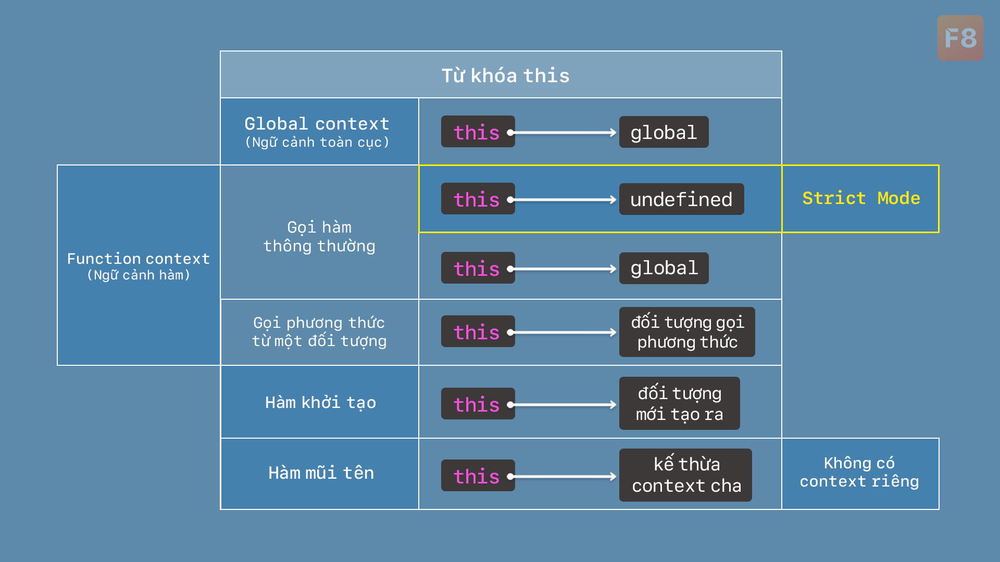

# Tìm hiểu từ khóa this nâng cao

Mục lục

* [Global Context (Ngữ cảnh toàn cục)](tim-hieu-tu-khoa-this-nang-cao.md#global-context-ngu-canh-toan-cuc)
* [Function Context (Ngữ cảnh hàm)](tim-hieu-tu-khoa-this-nang-cao.md#function-context-ngu-canh-ham)
  * [Hàm được gọi thông thường](tim-hieu-tu-khoa-this-nang-cao.md#ham-duoc-goi-thong-thuong)
  * [Phương thức của đối tượng](tim-hieu-tu-khoa-this-nang-cao.md#phuong-thuc-cua-doi-tuong)
* [Constructor Functions (Hàm khởi tạo)](tim-hieu-tu-khoa-this-nang-cao.md#constructor-functions-ham-khoi-tao)
* [Arrow Functions (Hàm mũi tên)](tim-hieu-tu-khoa-this-nang-cao.md#arrow-functions-ham-mui-ten)

<figure><figcaption></figcaption></figure>

Từ khóa `this` trong JavaScript rất linh hoạt và có thể trỏ đến các đối tượng khác nhau tùy vào ngữ cảnh mà nó được sử dụng. Dưới đây là chi tiết về cách `this` hoạt động trong các trường hợp khác nhau.

***

### Global Context (Ngữ cảnh toàn cục)

Trong ngữ cảnh toàn cục (ngoài bất kỳ hàm nào), `this` trỏ tới đối tượng toàn cục (global object). Trong trình duyệt web, đối tượng này là `window`; trong NodeJS, đối tượng này là `global`.

```javascript
console.log(this);
// Window {window: ƒ get window(), self: ƒ get self()…}
```

***

### Function Context (Ngữ cảnh hàm)

Trong một hàm thông thường, giá trị của `this` phụ thuộc vào cách mà hàm được gọi.

#### Hàm được gọi thông thường

Khi một hàm được gọi như một hàm thông thường (không phải phương thức của đối tượng), `this` trỏ tới đối tượng toàn cục (hoặc `undefined` trong Strict Mode).

Ví dụ:

```javascript
function showThis() {
    console.log(this);
}

showThis();
// Window {window: ƒ get window(), self: ƒ get self()…}
```

Trong Strict Mode:

```javascript
'use strict';

function showThis() {
    console.log(this);
}

showThis();
// undefined
```

#### Phương thức của đối tượng

Khi một hàm được gọi như một phương thức của một đối tượng, `this` trỏ tới đối tượng đó.

```javascript
const person = {
    name: 'John',
    showThis: function() {
        console.log(this);
    }
};

person.showThis();
// {name: "John", showThis: ƒ showThis()}
```

***

### Constructor Functions (Hàm khởi tạo)

Khi một hàm khởi tạo (constructor function) được gọi với từ khóa `new`, `this` trỏ tới đối tượng mới được tạo ra.

```javascript
function Person(name) {
    this.name = name;
    this.showThis = function() {
        console.log(this);
    }
}

const person = new Person('John');

console.log(person.name);
person.showThis();
// Person {name: "John", showThis: ƒ ()}
```

***

### Arrow Functions (Hàm mũi tên)

Hàm mũi tên không có `this` của riêng nó; thay vào đó, nó kế thừa `this` từ phạm vi từ nơi nó được định nghĩa.

```javascript
const person = {
    name: 'John',
    showThis: function() {
        const innerFunction = () => {
            console.log(this);
        };
        innerFunction();
    }
};

person.showThis();
// {name: "John", showThis: ƒ showThis()}
```


Tóm tắt

* **Ngữ cảnh toàn cục**: Trong ngữ cảnh toàn cục, `this` trỏ tới đối tượng toàn cục như `window` trong trình duyệt hoặc `global` trong NodeJS.
* **Ngữ cảnh hàm**:
  * **Hàm thông thường**: Khi gọi hàm như một hàm thông thường, `this` trỏ tới đối tượng toàn cục hoặc `undefined` trong Strict Mode.
  * **Phương thức của đối tượng**: Khi gọi hàm như một phương thức của đối tượng, `this` trỏ tới đối tượng đó.
* **Hàm khởi tạo**: Khi gọi hàm khởi tạo với từ khóa `new`, `this` trỏ tới đối tượng mới được tạo ra.
* **Hàm mũi tên**: Hàm mũi tên không có `this` riêng; nó kế thừa `this` từ phạm vi mà nó được định nghĩa.

