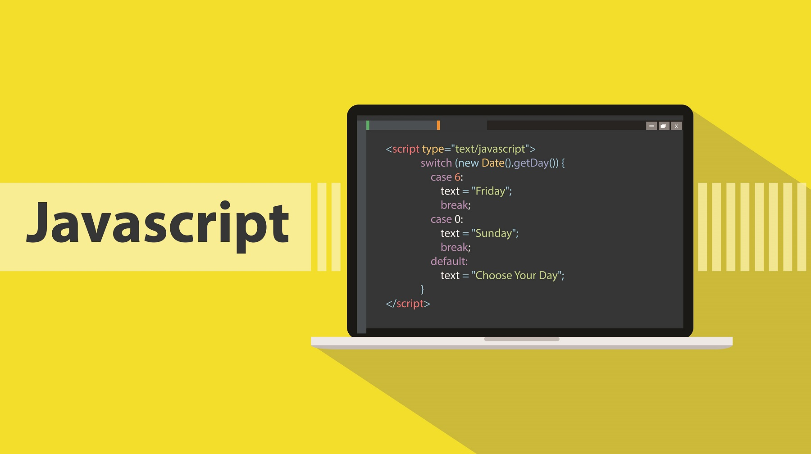
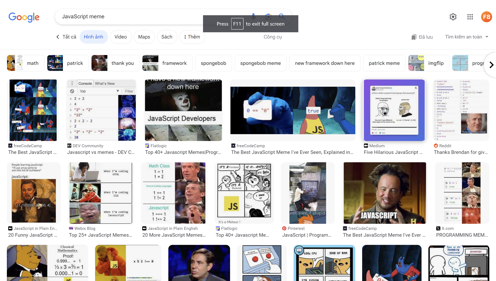
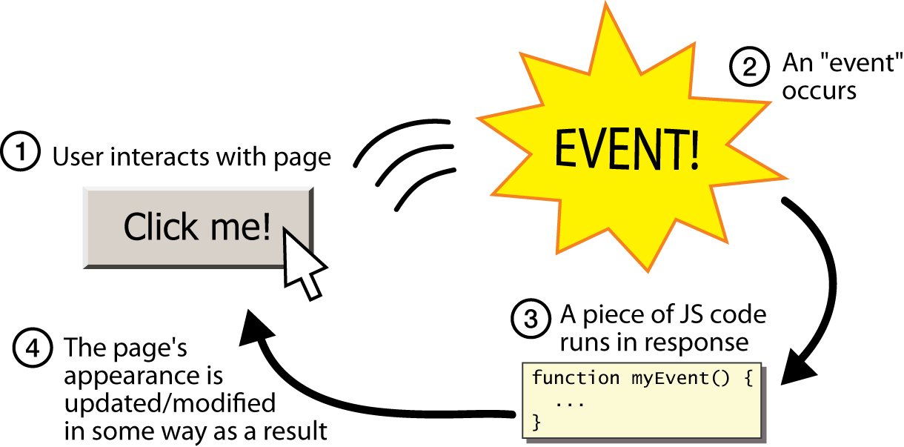

# JavaScript là gì?

Mục lục

* [Giới thiệu về JavaScript](javascript-la-gi.md#gioi-thieu-ve-javascript)
  * [Lịch sử JavaScript: Từ Mocha đến JavaScript](javascript-la-gi.md#lich-su-javascript-tu-mocha-den-javascript)
  * [Tại sao JavaScript lại quan trọng?](javascript-la-gi.md#tai-sao-javascript-lai-quan-trong)
  * [“Cây hài” trong làng ngôn ngữ lập trình](javascript-la-gi.md#cay-hai-trong-lang-ngon-ngu-lap-trinh)
* [JavaScript phía Máy khách và Máy chủ](javascript-la-gi.md#javascript-phia-may-khach-va-may-chu)
  * [Phía máy khách](javascript-la-gi.md#phia-may-khach)
  * [Phía máy chủ](javascript-la-gi.md#phia-may-chu)
* [Hạn chế của JavaScript](javascript-la-gi.md#han-che-cua-javascript)
  * [Định kiểu yếu](javascript-la-gi.md#dinh-kieu-yeu)
  * [Quản lý bất đồng bộ](javascript-la-gi.md#quan-ly-bat-dong-bo)
  * [Không nhất quán giữa các trình duyệt](javascript-la-gi.md#khong-nhat-quan-giua-cac-trinh-duyet)
  * [An toàn và bảo mật](javascript-la-gi.md#an-toan-va-bao-mat)
  * [Hiệu suất và quản lý bộ nhớ](javascript-la-gi.md#hieu-suat-va-quan-ly-bo-nho)

### Giới thiệu về JavaScript

Ngày nay, JavaScript là một ngôn ngữ lập trình không thể thiếu trên các trang web. JavaScript biến những trang web tĩnh, đơn điệu thành các “tác phẩm nghệ thuật” sống động, nơi mỗi click chuột đều mang lại một trải nghiệm thú vị.

> **Lưu ý**: JavaScript và Java là hai ngôn ngữ lập trình khác nhau.

#### Lịch sử JavaScript: Từ Mocha đến JavaScript

Trong quá khứ, Brendan Eich đã tạo ra JavaScript chỉ trong vòng 10 ngày ngắn ngủi. Ban đầu nó có tên là Mocha, sau đó đổi thành LiveScript, và cuối cùng là JavaScript. Từ ngôn ngữ nhỏ, hạn chế, JavaScript đã phát triển thành ngôn ngữ không thể thiếu trên hầu hết các trang web hiện nay.

#### Tại sao JavaScript lại quan trọng?

Hãy tưởng tượng một trang web mà không có JavaScript sẽ giống như một album ảnh tĩnh vậy, trong khi JavaScript sẽ làm nó trở thành một bộ phim thú vị và hấp dẫn.

Ví dụ: bạn có một trang web chỉ với HTML, CSS thì nội dung của nó là cố định, muốn thay đổi nội dung bạn sẽ phải sửa code. Trong khi JavaScript có thể biến trang web có nội dung động, như khi bạn đăng một bài trên Facebook thì bài viết đó tự xuất hiện mà không cần phải sửa code trong file HTML.

<figure><figcaption>
<em>JavaScript giúp trang web có thêm các tính năng tương tác lại với người dùng.</em>
</figcaption></figure>

Ngoài ra, với JavaScript trang web sẽ có nhiều tính năng tương tác lại với người dùng sau mỗi click chuột. Ví dụ: nhấn vào một button “Kiểm tra” trong màn thử thách của khóa học này, một loạt các quy trình sẽ được thực hiện để kiểm tra đoạn code của bạn xem có đúng hay không và sau đó trả về kết quả, sẽ không thể làm được việc đó nếu chỉ dùng HTML và CSS.

#### “Cây hài” trong làng ngôn ngữ lập trình

Trong cộng đồng lập trình, JavaScript nổi tiếng là một ngôn ngữ với những đặc điểm và hành vi đôi khi “kỳ quặc” hay “không dễ đoán trước”, khiến nó trở thành đề tài phổ biến cho nhiều meme và trò đùa trong giới lập trình viên.

<figure><figcaption></figcaption></figure>

Đặc điểm “kỳ quặc” của JavaScript: tự động ép kiểu (Type Coercion), so sánh lỏng lẻo, phạm vi biến động, callback, v.v.

Mặc dù những “đặc điểm” này có thể tạo ra khó khăn và nhầm lẫn, nhưng cũng chính là chúng làm cho JavaScript trở thành ngôn ngữ lập trình độc đáo và thú vị. Các meme và trò đùa không chỉ giúp giảm bớt căng thẳng trong quá trình học tập và làm việc mà còn tạo ra một cộng đồng lập trình viên gần gũi và hài hước.

Hơn nữa, việc hiểu rõ và vượt qua những “kỳ quặc” này cũng giúp lập trình viên trở nên thông thạo và linh hoạt hơn khi làm việc với JavaScript, cũng như phát triển kỹ năng giải quyết vấn đề và tư duy lập trình.

***

### JavaScript phía Máy khách và Máy chủ

JavaScript là ngôn ngữ có thể chạy trên đa nền tảng. Ngày nay, JavaScript có thể xây dựng được từ ứng dụng Web, Mobile, Desktop, v.v.

#### Phía máy khách

JavaScript phía máy khách chủ yếu được sử dụng để xây dựng giao diện người dùng tương tác trên các trang web. Mã JavaScript được thực thi trực tiếp trong trình duyệt của người dùng, không cần qua máy chủ.

<figure><figcaption>
<em>JavaScript xây dựng các tính năng phản hồi lại các tương tác từ người dùng.</em>
</figcaption></figure>

**Tính ứng dụng**: JavaScript có thể truy cập và sửa đổi các yếu tố DOM, cho phép thay đổi nội dung và hình thức trang web dễ dàng. JavaScript xử lý các sự kiện do người dùng tạo ra như click chuột, nhập liệu, di chuyển chuột, v.v.

> JavaScript còn được sử dụng để xây dựng các ứng dụng di động như iOS, Android và thậm chí cả các ứng dụng cho máy vi tính như Windows, MacOS, v.v.

#### Phía máy chủ

JavaScript chạy phía máy chủ thông qua Node.js, nhờ đó JavaScript không chỉ giới hạn chạy ở trình duyệt. Nó mở rộng khả năng của JavaScript đến việc xử lý logic nền và tương tác với cơ sở dữ liệu.

<figure><figcaption></figcaption></figure>

**Tính ứng dụng**: JavaScript trên máy chủ có thể xử lý yêu cầu, tương tác với cơ sở dữ liệu, và trả về dữ liệu đến trình duyệt. Xây dựng API cho các ứng dụng web, cung cấp cách thức để các ứng dụng khác nhau trao đổi dữ liệu và tương tác.

***

### Hạn chế của JavaScript

Mặc dù JavaScript là một ngôn ngữ lập trình mạnh mẽ và linh hoạt, nó không phải không có hạn chế. Hiểu rõ những hạn chế này giúp lập trình viên phát triển các giải pháp hiệu quả hơn và tránh các vấn đề tiềm ẩn.

#### Định kiểu yếu

JavaScript là một ngôn ngữ có định kiểu yếu, có nghĩa là các biến có thể tự động chuyển đổi kiểu dữ liệu. Điều này có thể dẫn đến các lỗi khó phát hiện do việc ép kiểu tự động không mong muốn.

#### Quản lý bất đồng bộ

JavaScript sử dụng mô hình bất đồng bộ, đặc biệt trong quản lý I/O và các yêu cầu mạng, điều này có thể gây khó khăn trong việc hiểu và quản lý luồng dữ liệu.

#### Không nhất quán giữa các trình duyệt

JavaScript có thể hoạt động khác nhau trên các trình duyệt khác nhau, đặc biệt với các tính năng mới hoặc không tiêu chuẩn.

#### An toàn và bảo mật

Phía trình duyệt, JavaScript có thể bị tấn công bởi các kỹ thuật như Cross-Site Scripting (XSS) khi xử lý không cẩn thận dữ liệu từ người dùng.

#### Hiệu suất và quản lý bộ nhớ

JavaScript không phải lúc nào cũng hiệu quả về mặt hiệu suất và quản lý bộ nhớ, đặc biệt với các ứng dụng lớn và phức tạp.

> Dù có những hạn chế, JavaScript vẫn là một ngôn ngữ lập trình quan trọng và không thể thiếu trong thế giới phát triển web hiện đại. Hiểu rõ và biết cách giải quyết những hạn chế này giúp lập trình viên tạo ra các ứng dụng web mạnh mẽ, an toàn và hiệu quả.


Tóm tắt

* **Tầm quan trọng của JavaScript**: JavaScript biến trang web tĩnh thành trang web động và nhiều tính năng tương tác với người dùng, là một ngôn ngữ không thể thiếu trong phát triển web ngày nay.
* **Lịch sử phát triển của JavaScript**: Ban đầu được phát triển bởi Brendan Eich trong 10 ngày với tên Mocha, sau đổi thành LiveScript và cuối cùng là JavaScript, trở thành một ngôn ngữ lập trình phổ biến.
* **“Cây hài” trong làng ngôn ngữ lập trình**: Nổi tiếng với các đặc điểm “kỳ quặc” như tự động ép kiểu và so sánh lỏng lẻo, trở thành đề tài cho nhiều meme và troll, nhưng cũng góp phần tạo nên sự độc đáo và thú vị cho ngôn ngữ này.
* **JavaScript làm cả Frontend và Backend**: JavaScript không chỉ giới hạn trong trình duyệt (máy khách) mà còn mở rộng sang máy chủ với Node.js, hỗ trợ xây dựng các ứng dụng đa nền tảng từ Frontend, Backend, Mobile, Desktop, v.v.
* **Hạn chế của JavaScript**: Bao gồm định kiểu yếu, quản lý bất đồng bộ, khác biệt giữa các trình duyệt, và vấn đề về an toàn, bảo mật, cũng như hiệu suất và quản lý bộ nhớ.
* **Kết luận**: Dù có hạn chế, JavaScript vẫn là một phần quan trọng không thể thiếu khi phát triển web ngày nay. Lập trình viên JavaScript cần có sự hiểu biết sâu về ngôn ngữ này và cần rèn luyện thêm tư duy logic, tư duy giải quyết vấn đề để có thể sử dụng ngôn ngữ này một cách hiệu quả.


